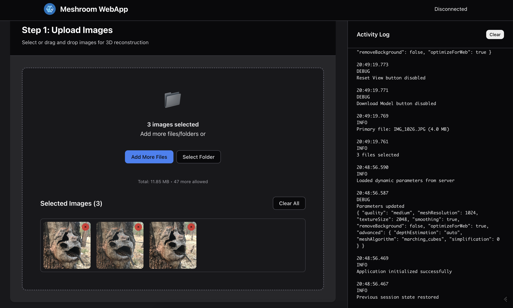
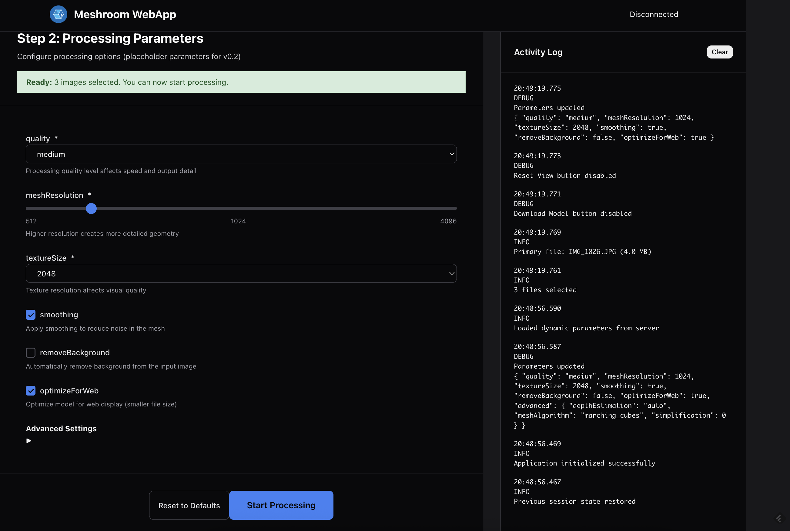
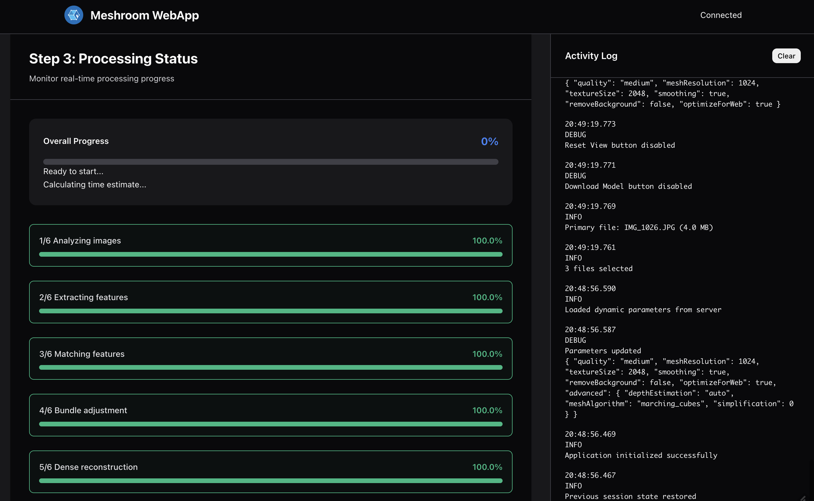
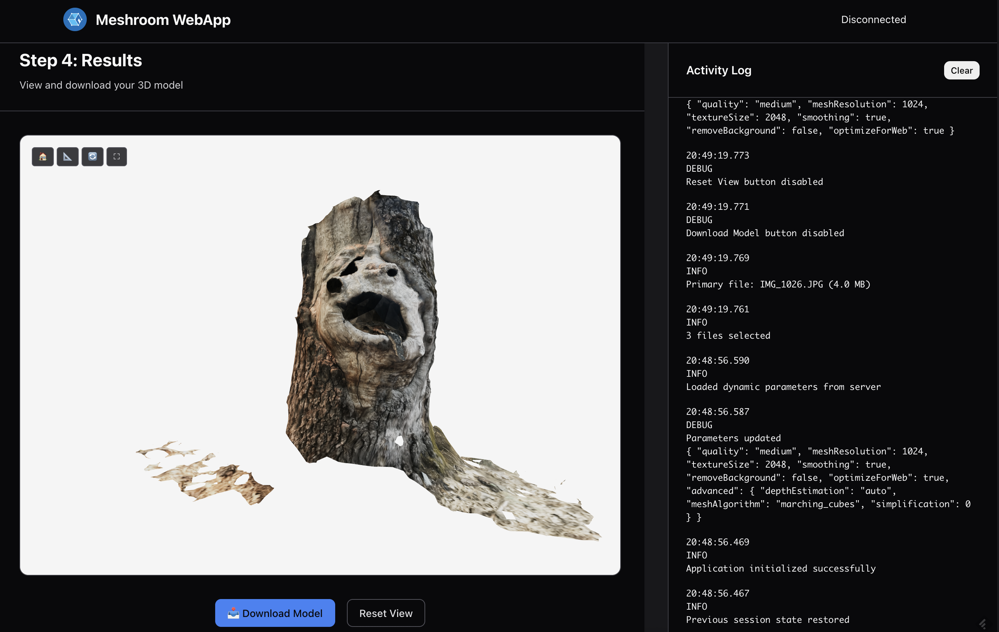

# Meshroom WebApp - Photogrammetry Client

A cross-platform photogrammetry application that generates 3D models from images using the Meshroom backend. This project provides both a fully functional web interface and testing tools for complete 3D reconstruction workflows.

## Project Overview

This application allows users to:

- Upload individual images or entire folders with directory structure preservation
- Configure processing parameters through a dynamic, user-friendly interface
- Monitor real-time processing progress with stage-by-stage visualization
- View generated 3D models in an interactive browser-based viewer
- Download completed models and access comprehensive processing logs

## Development Status

The project follows an incremental development strategy:

### ✅ Current Phase: Web Frontend (v0.2)

- ✅ **Modern Web UI**: Full-featured browser-based interface with drag-and-drop support
- ✅ **Directory Upload**: Recursive folder upload with structure preservation
- ✅ **Real-time Progress**: WebSocket-based progress tracking with visual feedback
- ✅ **3D Model Viewer**: Interactive Three.js-based model visualization
- ✅ **Parameter Configuration**: Dynamic parameter panel with validation
- ✅ **Activity Logging**: Comprehensive logging with filtering and export
- ✅ **Responsive Design**: Works on desktop, tablet, and mobile devices

### Previous Phases

- ✅ **Step 1 - Backend & Testing Tools (v0.1)**: FastAPI server with CLI and web API testing tools

### Future Phases

- **Step 3**: Integration with real Meshroom photogrammetry engine  
- **Step 4**: Mobile camera integration and video frame selection
- **Step 5**: Advanced mobile features with SLAM/AR

## Web Frontend v0.2 User Interface

The Web Frontend v0.2 provides a complete browser-based interface for 3D reconstruction workflows:

### Step 1 - Select Images



**Image Upload Options:**

- **Select Files**: Choose individual images from your device
- **Select Folder**: Choose entire directories with recursive image collection
- **Drag & Drop**: Drag images or folders directly into the application window
- **Image Preview**: Review selected images and remove unwanted ones before processing

**Features:**

- Supports JPEG, PNG, TIFF, WebP formats (max 100MB per file)  
- Preserves folder structure when uploading directories
- Real-time validation with detailed error messages
- Minimum 2 images required for 3D reconstruction

### Step 2 - Configure Settings  



**Dynamic Parameter Panel:**

- Automatically fetches available parameters from the server
- Generates appropriate UI controls for each parameter type (sliders, dropdowns, checkboxes)
- Parameter validation and constraint checking
- Collapsible sections for advanced options

### Step 3 - Start Processing



**Real-time Processing:**

- Multi-stage progress visualization with individual progress bars
- Live WebSocket updates with fallback polling
- Processing logs with filtering and search capabilities
- Stop/cancel processing at any time
- Time estimation and completion tracking

### Step 4 - Review Results



**Interactive 3D Viewer:**

- Three.js-based 3D model display (GLB, GLTF, OBJ, PLY support)
- Mouse/touch controls for orbit, pan, and zoom
- Multiple rendering modes (solid, wireframe, smooth shading)
- Auto-rotation and fullscreen viewing options
- Model download with various format options

## Quick Start

### Prerequisites

- Python 3.12+
- [uv](https://docs.astral.sh/uv/) package manager

### Installation

1. Clone the repository:

    ```bash
    git clone <repository-url>
    cd meshroom_webapp
    ```

2. Install uv (if not already installed):

    ```bash
    curl -LsSf https://astral.sh/uv/install.sh | sh
    # or on macOS: brew install uv
    ```

3. Create a virtual environment and install dependencies:

    ```bash
    uv sync --all-extras
    ```

    This will create a `.venv` directory and install all dependencies with their locked versions.

### Running the Application

#### Option 1: Web Frontend v0.2 (Recommended)

1. **Start the backend server:**

    ```bash
    ./start_fakebackend.sh
    ```

    Or manually:

    ```bash
    cd src/backend/fake_backend
    python server.py
    ```

    The server will start at `http://localhost:8000`

2. **Open the Web Frontend:**

    ```bash
    cd src/frontend/web_v0.2
    ./start_webserver-v0.2.sh
    ```

    Or open `src/frontend/web_v0.2/index.html` directly in your browser.

    The web application provides:

    - Drag-and-drop image and folder upload
    - Real-time progress monitoring with WebSocket updates
    - Interactive 3D model viewer
    - Comprehensive parameter configuration
    - Activity logging with search and export

#### Option 2: Development and Testing Tools

**CLI Client (for automated testing):**

```bash
cd src/frontend/fake_frontend
python client.py
```

**Web API Tester (for interactive API testing):**

Open `src/frontend/web_api_tester/web_test.html` in your browser for a point-and-click interface to test all API endpoints.

## Architecture

The project follows a modular architecture with clear separation between backend services, frontend clients, and supporting infrastructure:

```none
meshroom_webapp/
├── src/                           # Source code
│   ├── backend/
│   │   └── fake_backend/          # FastAPI simulation server
│   │       ├── server.py          # Main FastAPI application and endpoints
│   │       ├── models.py          # Pydantic models and data structures
│   │       └── jobs.py            # Job management and WebSocket handling
│   └── frontend/
│       ├── web_v0.2/              # Modern Web Frontend (Current)
│       │   ├── index.html         # Main application HTML
│       │   ├── js/                # JavaScript modules (ES6+)
│       │   │   ├── app.js         # Main application orchestrator
│       │   │   ├── fileManager.js # File upload and directory management
│       │   │   ├── parameterPanel.js # Dynamic parameter configuration
│       │   │   ├── progressTracker.js # Real-time progress visualization  
│       │   │   ├── modelViewer.js # 3D model display (Three.js)
│       │   │   ├── logPanel.js    # Activity logging and filtering
│       │   │   ├── apiClient.js   # Backend API communication
│       │   │   └── modal.js       # Dialog and modal systems
│       │   └── styles/            # Modular CSS with responsive design
│       ├── fake_frontend/         # CLI test client
│       │   └── client.py          # Complete workflow testing client
│       └── web_api_tester/        # Web-based API testing interface
│           ├── web_test.html      # Interactive HTML testing tool
│           └── README.md          # Detailed usage documentation
├── tests/                         # Test suite
│   ├── integration/               # End-to-end workflow tests
│   ├── quality/                   # Code quality and linting tests
│   ├── security/                  # Security vulnerability tests
│   └── run_tests.py              # Test runner with CI/CD integration
├── assets/                        # Static assets and screenshots
│   └── screenshots/               # UI documentation screenshots
├── docs/                          # Project documentation
│   └── v0.2.md                   # Web Frontend v0.2 feature documentation
├── .github/workflows/             # CI/CD pipeline configuration
├── reports/                       # Generated test and quality reports
├── requirements.txt               # Python dependencies
├── requirements-test.txt          # Testing dependencies
└── pyproject.toml                # Project configuration
```

### Web Frontend v0.2 Architecture

**Main Application** (`src/frontend/web_v0.2/app.js`)

- Application orchestration and global state management
- Event handling and keyboard shortcuts
- Error handling coordination and user notifications
- Module lifecycle management

**File Management** (`src/frontend/web_v0.2/js/fileManager.js`)  

- Drag-and-drop file and directory upload
- Recursive directory traversal with structure preservation
- File validation and preview generation
- Real-time upload progress tracking

**Parameter Configuration** (`src/frontend/web_v0.2/js/parameterPanel.js`)

- Dynamic parameter form generation from server schema
- Parameter validation and constraint checking
- Collapsible advanced parameter sections
- Real-time parameter preview and feedback

**Progress Visualization** (`src/frontend/web_v0.2/js/progressTracker.js`)

- Multi-stage progress bars with WebSocket updates
- Fallback HTTP polling for robust connectivity
- Time estimation and completion tracking
- Stage-by-stage processing visualization

**3D Model Viewer** (`src/frontend/web_v0.2/js/modelViewer.js`)

- Three.js-based 3D rendering engine
- Multiple model format support (GLB, GLTF, OBJ, PLY)
- Interactive camera controls and scene management
- Multiple rendering modes (solid, wireframe, smooth shading)

**Activity Logging** (`src/frontend/web_v0.2/js/logPanel.js`)

- Real-time log display with WebSocket integration
- Log level filtering (error, warning, info, debug)
- Search functionality and log export capabilities
- Auto-scrolling and performance optimization

### Backend Architecture

**FastAPI Application** (`src/backend/fake_backend/server.py`)

- RESTful API endpoints for job management
- WebSocket endpoint for real-time progress updates
- CORS middleware for cross-origin requests
- Directory upload with path traversal protection

**FastAPI Application** (`src/backend/fake_backend/server.py`)

- RESTful API endpoints for job management
- WebSocket endpoint for real-time progress updates
- CORS middleware for cross-origin requests
- Command-line configuration with argparse

**Data Models** (`src/backend/fake_backend/models.py`)  

- `ProcessingJob`: Job lifecycle and metadata with directory path support
- `ImageData`: Image file information and validation with original path preservation
- `UploadRequest`: Request parameter validation
- `JobResponse`: API response structures

**Job Management** (`src/backend/fake_backend/jobs.py`)

- `JobManager`: Thread-safe job orchestration
- Asynchronous processing simulation with realistic stages
- WebSocket connection management for multiple clients
- Model generation (both dummy and real asset loading)

### Frontend Architecture (v0.1)

**CLI Client** (`src/frontend/fake_frontend/client.py`)

- `PhotogrammetryClient`: Complete workflow testing
- Image generation and upload simulation
- WebSocket-based progress monitoring with threading
- Model download with retry logic and error handling

**Web API Tester** (`src/frontend/web_api_tester/web_test.html`)

- Interactive HTML-based testing interface for all API endpoints
- Real-time WebSocket progress monitoring with visual feedback
- Point-and-click testing without requiring command-line knowledge
- Automatic file handling and response logging
- See [detailed documentation](src/frontend/web_api_tester/README.md) for full usage guide

### Development Infrastructure

**Testing Framework** (`tests/`)

- Integration tests for complete workflows
- Quality assurance with automated code formatting
- Security vulnerability scanning
- Cross-platform compatibility testing

**CI/CD Pipeline** (`.github/workflows/`)

- Automated testing on Python 3.10-3.13
- Code quality enforcement (flake8, mypy, black, isort)
- Security analysis (bandit, safety)
- Report generation and artifact collection

### Future Architecture Evolution

- **v0.2**: Web frontend with React/Vue.js browser interface
- **v1.0**: Real Meshroom backend integration with containerized services  
- **v2.0**: Mobile apps with native camera integration
- **v3.0**: AR/SLAM modules with real-time processing capabilities

## API Endpoints

### Backend REST API

- `GET /` - Server status and information
- `GET /health` - Health check
- `POST /upload` - Upload images for processing
- `GET /jobs/{job_id}` - Get job status
- `GET /jobs/{job_id}/download` - Download generated model
- `DELETE /jobs/{job_id}` - Cancel job
- `WS /ws/{job_id}` - WebSocket for progress updates

## Features

### Web Frontend v0.2 Features

- ✅ **Modern Web Interface**: Responsive, accessible browser-based UI
- ✅ **Advanced File Upload**:
  - Drag-and-drop support for files and entire directories
  - Recursive folder processing with structure preservation  
  - Real-time upload progress and validation
  - Support for JPEG, PNG, TIFF, WebP (max 100MB per file)
- ✅ **Dynamic Parameter Configuration**:
  - Server-driven parameter form generation
  - Real-time validation and constraint checking
  - Collapsible advanced parameter sections
- ✅ **Real-time Progress Tracking**:
  - Multi-stage progress visualization
  - WebSocket updates with HTTP polling fallback
  - Processing logs with search and filtering
  - Time estimation and completion tracking
- ✅ **Interactive 3D Viewer**:
  - Three.js-based model display
  - Multiple format support (GLB, GLTF, OBJ, PLY)
  - Camera controls (orbit, pan, zoom)
  - Rendering modes (solid, wireframe, smooth shading)
  - Auto-rotation and fullscreen viewing
- ✅ **Enhanced User Experience**:
  - Dark mode support with system preference detection
  - Keyboard shortcuts and accessibility features
  - Comprehensive error handling with recovery options
  - Activity logging with export capabilities

### Backend Features

- ✅ **Robust API**: FastAPI server with comprehensive validation
- ✅ **Directory Upload**: Folder structure preservation with security protection
- ✅ **Real-time Communication**: WebSocket progress updates
- ✅ **Security**: Path traversal protection and input sanitization
- ✅ **Testing Tools**: CLI client and web API tester

### Development Infrastructure

- ✅ **Quality Assurance**: Automated testing, linting, and security scanning
- ✅ **CI/CD Pipeline**: GitHub Actions with cross-platform testing
- ✅ **Documentation**: Comprehensive code documentation and user guides
- ✅ **Modular Architecture**: Clean separation of concerns for maintainability

### Planned Features

- 🔄 **Real Meshroom Integration**: Connect to actual photogrammetry processing engine
- 🔄 **Multi-Image Batch Processing**: Advanced batch processing with queue management
- 🔄 **Mobile Camera Integration**: Native camera capture and video frame selection
- 🔄 **AR/SLAM Features**: Advanced mobile features with real-time tracking
- 🔄 **User Accounts**: Save preferences and processing history
- 🔄 **Advanced Parameters**: More detailed processing configuration options

## Development

### Browser Requirements

**Web Frontend v0.2** works with modern browsers supporting:

- **Chrome**: Version 80+ (2020)
- **Firefox**: Version 75+ (2020)  
- **Safari**: Version 13+ (2019)
- **Edge**: Version 80+ (2020)

**Required Features**: ES6 Modules, WebSocket API, Drag and Drop API, File API, WebGL, CSS Grid/Flexbox

### Code Quality Standards

- Python 3.9+ compatibility
- Modern JavaScript (ES6+ modules)
- Google-style docstrings and JSDoc documentation
- Type hints for all functions
- Comprehensive error handling
- Modular, testable design
- PEP 8 code formatting and accessibility compliance

### Testing

**Web Frontend v0.2:**

- Open `src/frontend/web_v0.2/index.html` in a modern browser
- Test drag-and-drop with image files and directories
- Verify real-time progress tracking and WebSocket connectivity
- Test 3D model viewer functionality

**Backend and Integration:**

Run the complete workflow test:

```bash
python src/frontend/fake_frontend/client.py
```

**Quality and Security:**

```bash
# Run all tests  
uv run tests/run_tests.py

# Run with auto-fix for formatting issues
uv run tests/run_tests.py --quality --fix

# Run integration tests
uv run tests/run_tests.py --integration
```

### Contributing

This project follows incremental development. Each phase builds upon the previous one while maintaining backward compatibility for testing and validation.

## License

This project is licensed under the Mozilla Public License Version 2.0 (MPL-2.0), see the [LICENSE](LICENSE) file.

### Third-Party Dependencies

This project uses various open-source libraries, each with their own licenses:

- **FastAPI**: MIT License
- **Pydantic**: MIT License  
- **WebSocket-client**: Apache License 2.0
- **Requests**: Apache License 2.0

Run `pip-licenses` to see all dependency licenses:

```bash
uv tool run pip-licenses --format=table --with-license-file --no-license-path
```

## 🚀 CI/CD Pipeline

This project includes a comprehensive continuous integration and deployment pipeline with:

- **Automated Testing**: Integration, quality, and security tests
- **Code Quality**: Linting (flake8), formatting (black), type checking (mypy)
- **Security Scanning**: Dependency vulnerabilities (safety) and static analysis (bandit)
- **Cross-Platform**: Tests on Python 3.12-3.14

See [.github/workflows/PIPELINE_GUIDE.md](.github/workflows/PIPELINE_GUIDE.md) for detailed documentation.

### Quick Pipeline Usage

```bash
# Run all tests
uv run tests/run_tests.py

# Run with auto-fix for formatting issues
uv run tests/run_tests.py --quality --fix

# Run quick integration tests
uv run tests/run_tests.py --integration --quick
```

## Support

For issues and questions, please [create an issue](../../issues) in the repository.
