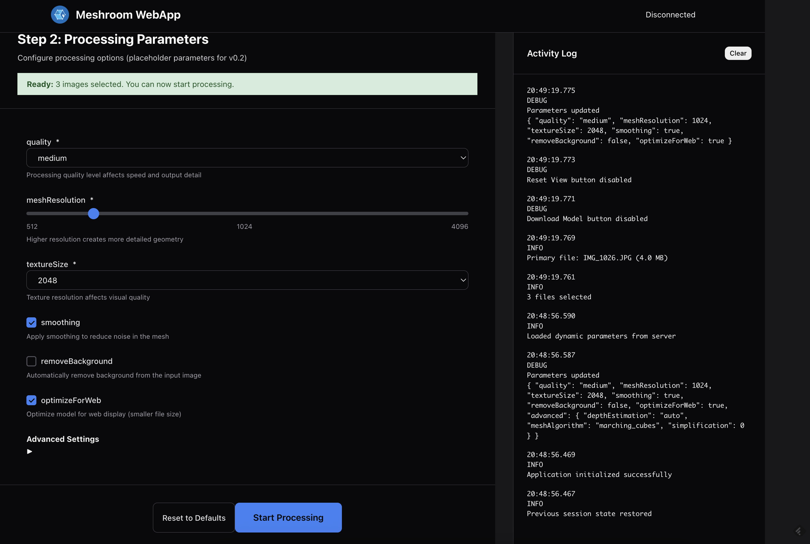

# Meshroom WebApp v0.2 - User Interface Guide

The Meshroom WebApp v0.2 provides a modern, browser-based interface for 3D photogrammetry workflows. This comprehensive guide walks you through each step of the process, from selecting images to viewing your final 3D model.

## Overview

The web interface follows a intuitive 4-step workflow:

1. **Select Images** - Upload individual files or entire directories  
2. **Configure Settings** - Adjust processing parameters using dynamic controls
3. **Start Processing** - Monitor real-time progress with detailed feedback
4. **Review Results** - Interact with your 3D model and download files

### System Requirements

- **Modern Browser**: Chrome 80+, Firefox 75+, Safari 13+, or Edge 80+
- **JavaScript**: Must be enabled for full functionality
- **Network**: Active internet connection for backend communication
- **Hardware**: WebGL-capable graphics for 3D model viewing

---

## Step 1 - Select Images


### Image Selection Methods

The application offers multiple flexible ways to select your images:

#### **Select Files Button**

- Choose individual images from your device using the standard file dialog
- Supports multiple selection (Ctrl/Cmd + click)
- Ideal for curated image sets from different locations

#### **Select Folder Button**  

- Choose entire directories for bulk upload
- **Recursive processing**: Automatically finds images in all subdirectories
- **Folder structure preservation**: Maintains your original directory organization on the server
- Perfect for organized photo shoots with multiple folders

#### **Drag & Drop Interface**

- Simply drag images or entire folders directly into the upload area
- **Visual feedback**: Upload area highlights when files are dragged over
- **Mixed uploads**: Can drag both individual files and folders simultaneously
- **Instant validation**: Real-time feedback on file compatibility

### Image Management Features

#### **Preview Grid**

- **Thumbnail generation**: Automatic preview creation for all uploaded images
- **Image metadata**: Displays resolution, file size, and format information

- **Quick removal**: Click the ❌ icon to remove unwanted images
- **Drag reordering**: Rearrange images by dragging thumbnails (future feature)

#### **File Validation**

- **Format support**: JPEG, PNG, TIFF, WebP formats accepted

- **Size limits**: Maximum 100MB per individual file
- **Quality checks**: Automatic detection of corrupted or invalid files
- **Duplicate detection**: Identifies and warns about duplicate images

#### **Batch Operations**

- **Select all/none**: Quickly manage large image sets
- **Bulk removal**: Remove multiple images with batch selection
- **Sort options**: Organize by name, size, or date

### Upload Requirements

- **Minimum images**: At least 2 images required for 3D reconstruction
- **Recommended**: 10-50 images for optimal results

- **Maximum**: Up to 1000 images supported (performance may vary)

- **Total size limit**: 500MB maximum per upload session

### Advanced Features

#### **Directory Structure Preservation**

When uploading folders, the original directory structure is maintained:

```none
Your Folder/
├── Scene1/

│   ├── IMG_001.jpg
│   └── IMG_002.jpg
└── Scene2/
    ├── IMG_003.jpg
    └── IMG_004.jpg
```

#### **Error Handling**

- **Detailed error messages**: Specific feedback for rejected files
- **Recovery suggestions**: Guidance on resolving common issues  
- **Partial success**: Process valid files even if some are rejected
- **Error logs**: Comprehensive logging for troubleshooting

---

## Step 2 - Configure Settings



### Dynamic Parameter System

The parameter panel automatically adapts based on the backend's available settings, ensuring you always have access to the latest processing options.

#### **Parameter Categories**

##### **Quality Settings**

- **Reconstruction Quality**: Choose from Draft, Normal, High, or Ultra
- **Texture Resolution**: Control the detail level of surface textures
- **Mesh Density**: Adjust the polygon count for the final 3D model

##### **Processing Options**

- **Feature Detection**: Algorithm selection for identifying image features  
- **Matching Method**: Choose how images are compared and aligned
- **Filtering Level**: Control noise reduction in the final model

##### **Advanced Parameters**

- **Calibration Settings**: Camera calibration and lens correction options
- **Meshing Parameters**: Control surface reconstruction algorithms
- **Texturing Options**: Advanced material and lighting parameters

#### **UI Control Types**

The interface automatically generates appropriate controls for each parameter:

##### **Sliders**

- **Numeric ranges**: Precise control with visual feedback
- **Real-time preview**: See parameter effects before processing
- **Step controls**: Fine-tune values with +/- buttons

- **Reset option**: Quickly return to default values

##### **Dropdown Menus**

- **Predefined options**: Choose from optimized presets
- **Tooltips**: Detailed explanations for each option
- **Performance indicators**: Speed vs. quality indicators

##### **Checkboxes**

- **Boolean options**: Simple on/off toggles
- **Dependent parameters**: Automatically enable/disable related options

- **Batch settings**: Apply settings to multiple parameters

##### **Text Inputs**

- **Custom values**: Enter specific numeric or text values
- **Validation**: Real-time checking for valid inputs

- **Unit conversion**: Automatic handling of different measurement units

#### **Parameter Management**

##### **Presets**

- **Built-in presets**: Fast, Balanced, Quality, and Custom modes
- **Save custom**: Store your preferred settings for future use
- **Import/Export**: Share parameter configurations with others

##### **Advanced Features**

- **Collapsible sections**: Hide advanced parameters to reduce clutter
- **Search function**: Quickly find specific parameters
- **Help system**: Integrated documentation for each parameter
- **Parameter dependencies**: Automatic adjustment of related settings

##### **Validation & Feedback**

- **Real-time validation**: Immediate feedback on parameter combinations
- **Warning indicators**: Alerts for potentially problematic settings
- **Performance estimates**: Predicted processing time and resource usage
- **Conflict resolution**: Automatic suggestions for conflicting parameters

---

## Step 3 - Start Processing


### Real-time Processing Monitoring

Once you click "Start Processing," the interface transforms into a comprehensive monitoring dashboard.

#### **Multi-Stage Progress Visualization**

##### **Dynamic Progress Bars**

- **Stage-specific bars**: Individual progress indicators for each processing step
- **Percentage completion**: Precise progress tracking (0-100% per stage)
- **Visual hierarchy**: Current stage highlighted with enhanced styling
- **Smooth animations**: Fluid progress bar updates for better user experience

##### **Dynamic Processing Stages**

The interface **automatically discovers processing stages** from backend progress messages, eliminating the need for hardcoded stage definitions. This dynamic approach offers several advantages:

**Adaptive Stage Detection:**

- **Real-time discovery**: New progress bars are created automatically when new stage messages are received
- **Pipeline flexibility**: Supports any Meshroom pipeline configuration without client updates
- **Stage naming**: Uses the exact stage names provided by the backend processing engine
- **Automatic completion**: Progress bars complete (100%) when the backend moves to the next stage

**Backend Message Format:**
The client expects progress messages in the format: `"{stage_name}... {progress:.1f}%"`

**Example Processing Flow:**

1. Backend sends: `"Image Analysis... 25.0%"` → Creates "Image Analysis" progress bar
2. Backend sends: `"Image Analysis... 100.0%"` → Completes the stage
3. Backend sends: `"Feature Matching... 15.0%"` → Creates new "Feature Matching" progress bar
4. And so on for all pipeline stages...

This approach ensures the interface **automatically adapts** to:

- **Pipeline evolution**: New stages appear automatically as Meshroom develops
- **Different algorithms**: Various reconstruction methods with different stage sequences  
- **Custom workflows**: User-defined processing pipelines with specialized stages
- **Research features**: Experimental stages without requiring interface updates

#### **Communication Systems**

##### **WebSocket Updates**

- **Real-time messaging**: Instant progress updates from the server
- **Automatic reconnection**: Handles network interruptions gracefully

- **Message queuing**: Ensures no updates are lost during brief disconnections

##### **HTTP Polling Fallback**

- **Network resilience**: Continues working even if WebSockets fail
- **Corporate firewall friendly**: Works through restrictive network configurations

- **Automatic switching**: Seamlessly falls back when needed

#### **Processing Controls**

##### **Stop/Cancel Button**

- **Immediate termination**: Stop processing at any stage
- **Safe cancellation**: Ensures partial results are saved when possible
- **Resource cleanup**: Properly releases server resources
- **Confirmation dialog**: Prevents accidental cancellation

#### **Activity Logging System**

##### **Real-time Log Display**

- **Live updates**: Messages appear instantly as processing progresses
- **Message categorization**: Color-coded by importance level
- **Timestamp tracking**: Precise timing for each processing step
- **Auto-scrolling**: Automatically follows the latest messages

##### **Log Filtering**

- **Level filtering**: Show/hide by severity (Error, Warning, Info, Debug)
- **Search functionality**: Find specific messages or keywords
- **Stage filtering**: Focus on particular processing stages
- **Time range selection**: View logs from specific time periods

##### **Log Management**

- **Export capabilities**: Save logs as JSON, CSV, or plain text
- **Log persistence**: Maintain logs across browser sessions
- **Clear functionality**: Clean up logs when needed
- **Performance optimization**: Efficient handling of large log volumes

---

## Step 4 - Review Results


### Interactive 3D Model Viewer

The final step showcases your reconstructed 3D model using a powerful, browser-based viewer built on Three.js technology.

#### **3D Visualization Engine**

##### **Multiple Model Format Support**

- **GLB/GLTF**: Industry-standard format with PBR materials
- **OBJ**: Classic format with texture mapping support  
- **PLY**: Point cloud and mesh format for scientific applications
- **STL**: Solid model format for 3D printing compatibility

##### **Rendering Capabilities**

- **Hardware acceleration**: Utilizes WebGL for smooth performance

- **High-quality shading**: Realistic lighting and material representation
- **Anti-aliasing**: Smooth edges and reduced visual artifacts
- **Adaptive quality**: Automatically adjusts based on device capabilities

#### **Interactive Controls**

##### **Camera Navigation**

- **Orbit controls**: Click and drag to rotate around the model
- **Pan functionality**: Right-click drag or Shift+drag to move the view
- **Zoom capabilities**: Mouse wheel or pinch gestures for closer inspection
- **Touch support**: Full gesture support on tablets and smartphones

##### **View Controls**

- **Reset view**: Return to the default camera position with one click
- **Fit to screen**: Automatically frame the model optimally
- **Preset angles**: Quick access to front, side, and top views
- **Custom viewpoints**: Save and recall your preferred viewing angles

#### **Rendering Modes**

##### **Material Visualization**

- **Textured mode**: Full-color display with applied textures and materials
- **Wireframe mode**: See the underlying mesh structure
- **Solid color**: Uniform coloring to focus on geometry
- **Vertex colors**: Display per-vertex color information when available

##### **Shading Options**

- **Smooth shading**: Interpolated normals for smooth surfaces
- **Flat shading**: Faceted appearance showing individual triangles  
- **PBR rendering**: Physically-based rendering with realistic materials

- **Custom shaders**: Advanced rendering effects (future feature)

#### **Model Analysis Tools**

##### **Information Display**

- **Model statistics**: Vertex count, face count, and texture information
- **Bounding box**: Dimensional measurements of the model

- **File size**: Storage requirements for different formats
- **Processing metadata**: Information about reconstruction parameters used

#### **Export and Download Options**

##### **Model Downloads**

- **Multiple formats**: Choose from GLB, OBJ, PLY, or STL formats
- **Quality options**: Select between optimized or full-resolution versions
- **Texture packaging**: Include or exclude texture maps as needed
- **Batch export**: Download multiple formats simultaneously

#### **Troubleshooting**

##### **Common Issues**

- **Black screen**: Check WebGL support and update graphics drivers

- **Slow performance**: Reduce model quality or close other browser tabs
- **Missing textures**: Verify texture files were included in the upload
- **Controls not working**: Check browser compatibility and JavaScript settings

##### **Browser Compatibility**

- **Chrome**: Full feature support with best performance
- **Firefox**: Complete functionality with good performance
- **Safari**: Full support on macOS and iOS devices
- **Edge**: Complete compatibility with all features

---

## Additional Features

### Accessibility & Usability

#### **Keyboard Navigation**

- **Tab navigation**: Navigate through all interactive elements
- **Keyboard shortcuts**: Quick access to common functions
  - `Ctrl/Cmd + O`: Open file dialog
  - `Ctrl/Cmd + Enter`: Start processing (when files are selected)
  - `Ctrl/Cmd + S`: Save current state
  - `Escape`: Close active modal dialogs

#### **Modal Accessibility**

- **ARIA attributes**: Modal dialogs include proper ARIA labels and roles
- **Focus trapping**: Focus is trapped within modal dialogs
- **Focus restoration**: Focus returns to previous element when modal closes
- **Keyboard navigation**: Full keyboard support for modal interactions

#### **Visual Accessibility**

- **Button titles**: Tooltip descriptions for icon buttons
- **Image alt text**: Alternative text for images and icons
- **Focus indicators**: Visual focus indicators for keyboard navigation
- **High contrast support**: CSS focus styles for improved visibility

#### **Responsive Design**

- **Desktop optimization**: Full-featured experience on large screens
- **Tablet support**: Touch-friendly interface with gesture controls
- **Mobile compatibility**: Essential features available on smartphones
- **Adaptive layouts**: Interface adjusts to available screen space

### Customization Options

#### **Theme Support**

- **Dark mode**: Automatic detection of system preference
- **Light mode**: Traditional bright interface option
- **High contrast**: Enhanced visibility for accessibility
- **Custom themes**: User-defined color schemes (future feature)

#### **Interface Preferences**

- **Panel layout**: Customize the arrangement of interface panels
- **Default parameters**: Set preferred processing settings
- **Keyboard shortcuts**: Customize hotkey assignments
- **Language selection**: Multi-language support (future feature)

---

## Getting Started Tips

### First-Time Users

1. **Start small**: Begin with 5-10 high-quality images
2. **Use defaults**: Default parameters work well for most cases
3. **Check requirements**: Ensure your browser meets the minimum requirements
4. **Stable network**: Use a reliable internet connection for best results

### Best Practices

- **Image overlap**: Ensure 50-70% overlap between consecutive images
- **Lighting consistency**: Use consistent lighting across all images
- **Avoid motion blur**: Use fast shutter speeds or stable subjects
- **Multiple angles**: Capture your subject from various viewpoints

### Performance Tips

- **Close other tabs**: Free up browser memory for better performance
- **Wired connection**: Use Ethernet instead of WiFi when possible
- **Modern browser**: Keep your browser updated for best performance
- **Hardware acceleration**: Ensure GPU acceleration is enabled
